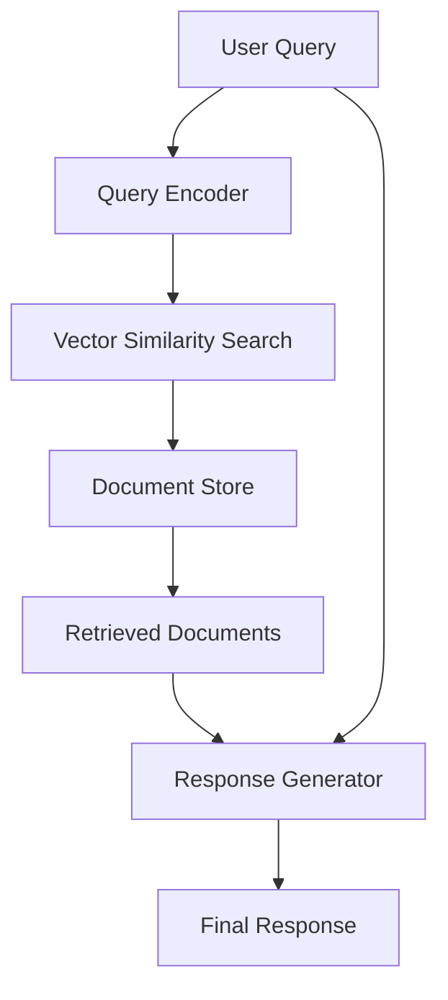

# Explaining LLM Concepts

## 1. Advanced Terminology Related to LLMs and Agents

### Key Terms in LLMs

**Transformer Architecture**: The foundational architecture for most modern LLMs, introduced in the paper "Attention is All You Need" by Vaswani et al. (2017). It relies on self-attention mechanisms to process input sequences in parallel rather than sequentially.

**Attention Mechanism**: A mechanism that allows the model to focus on different parts of the input sequence when producing each element of the output sequence. The attention score between two tokens represents their relevance.

**Self-Attention**: A special case of attention where the query, key, and value vectors all come from the same sequence, allowing each position to attend to all positions in the previous layer.

**Multi-Head Attention**: An extension of the attention mechanism that runs several attention layers in parallel, allowing the model to jointly attend to information from different representation subspaces.

**Tokens**: The basic units that LLMs process. In text, these are usually subword units created through tokenization algorithms like Byte-Pair Encoding (BPE) or SentencePiece.

**Embeddings**: Dense vector representations of tokens in a continuous vector space, where semantically similar tokens are positioned closer together.

**Positional Encoding**: Information added to embeddings to give the model awareness of token order in the sequence, since the transformer architecture doesn't inherently process sequences in order.

**Layers**: The building blocks of transformer models, each consisting of multi-head attention mechanisms and feed-forward neural networks, with residual connections and layer normalization.

**Parameters**: The weights and biases that the model learns during training. Modern LLMs have billions or even trillions of parameters.

**Inference**: The process of using a trained model to generate predictions or outputs for new inputs.

**Fine-tuning**: The process of further training a pre-trained model on a smaller, task-specific dataset to adapt it to a particular domain or task.

### Key Terms in Agents

**Agent**: An autonomous entity that perceives its environment through sensors and acts upon that environment through actuators to achieve specific goals.

**LLM Agent**: An AI agent that uses a Large Language Model as its core reasoning or decision-making component.

**ReAct (Reasoning + Acting)**: A prompting framework that combines reasoning and acting, where the model generates both reasoning traces and task-specific actions in an interleaved manner.

**Tool Use**: The capability of an agent to interact with external functions or APIs to extend its capabilities beyond text generation.

**Memory**: The ability of an agent to store and retrieve information across interactions, which can be short-term (within a conversation) or long-term (across multiple sessions).

**Planning**: The process by which an agent decomposes a complex task into subtasks and determines the sequence of actions to achieve a goal.

**Reflection**: The ability of an agent to evaluate and refine its past actions or decisions to improve future performance.

## 2. Comparing Different Methods of LLM Customization

There are several approaches to customize LLMs for specific tasks or domains:

### Full Fine-tuning

**Description**: Updating all parameters of a pre-trained model on a task-specific dataset.

**Advantages**:
- Maximum flexibility to adapt the model
- Can achieve high performance on the target task
- No constraints on what aspects of the model can be modified

**Disadvantages**:
- Computationally expensive
- Requires significant memory and storage
- Risk of catastrophic forgetting (losing general capabilities)
- Difficult to deploy multiple specialized versions

**Example Code**:
```python
from transformers import AutoTokenizer, AutoModelForCausalLM, Trainer, TrainingArguments

# Load pre-trained model and tokenizer
model_name = "gpt2"
tokenizer = AutoTokenizer.from_pretrained(model_name)
model = AutoModelForCausalLM.from_pretrained(model_name)

# Add padding token if not present
if tokenizer.pad_token is None:
    tokenizer.pad_token = tokenizer.eos_token

# Prepare your dataset
train_dataset = YourCustomDataset(tokenizer, file_path="your_data.txt")

# Define training arguments
training_args = TrainingArguments(
    output_dir="./fine-tuned-model",
    per_device_train_batch_size=4,
    gradient_accumulation_steps=4,
    num_train_epochs=3,
    learning_rate=2e-5,
    fp16=True,
    logging_steps=100,
    save_steps=500,
)

# Initialize trainer
trainer = Trainer(
    model=model,
    args=training_args,
    train_dataset=train_dataset,
)

# Fine-tune the model
trainer.train()

# Save the model
model.save_pretrained("./fine-tuned-model")
tokenizer.save_pretrained("./fine-tuned-model")
```

### Parameter-Efficient Fine-tuning (PEFT)

#### LoRA (Low-Rank Adaptation)

**Description**: Freezes the pre-trained model weights and injects trainable rank decomposition matrices into each layer of the Transformer architecture.

**Advantages**:
- Significantly reduces the number of trainable parameters
- Maintains model quality while being memory-efficient
- Easy to switch between different adaptations
- No additional inference latency

**Disadvantages**:
- Still requires some computational resources for training
- May not be as effective as full fine-tuning for very complex tasks

**Example Code**:
```python
from peft import LoraConfig, get_peft_model
from transformers import AutoModelForCausalLM, AutoTokenizer

# Load model and tokenizer
model_name = "meta-llama/Llama-2-7b-hf"
model = AutoModelForCausalLM.from_pretrained(model_name)
tokenizer = AutoTokenizer.from_pretrained(model_name)

# Configure LoRA
lora_config = LoraConfig(
    r=8,  # Rank of the low-rank matrices
    lora_alpha=32,  # Scaling factor
    target_modules=["q_proj", "v_proj"],  # Modules to apply LoRA to
    lora_dropout=0.05,
    bias="none",
    task_type="CAUSAL_LM"
)

# Apply LoRA to the model
model = get_peft_model(model, lora_config)

# Print trainable parameters
model.print_trainable_parameters()

# Now you can train the model with significantly fewer parameters
```

#### Adapter Modules

**Description**: Small neural network modules inserted between layers of the pre-trained model that are trained while keeping the original model frozen.

**Advantages**:
- Minimal impact on the original model
- Easy to add and remove
- Can be combined with other PEFT methods

**Disadvantages**:
- Adds inference overhead
- May require more training time than LoRA

### Prompt Engineering

**Description**: Crafting input prompts to guide the model's behavior without modifying its parameters.

**Advantages**:
- No training required
- Immediate deployment
- Cost-effective
- Easy to experiment with

**Disadvantages**:
- Limited by the model's existing knowledge
- May require extensive manual tuning
- Less consistent than fine-tuning
- Difficult to scale for complex tasks

**Example Code**:
```python
import openai

def generate_with_prompt(prompt, model="gpt-3.5-turbo"):
    response = openai.ChatCompletion.create(
        model=model,
        messages=[
            {"role": "system", "content": "You are a helpful assistant specialized in medical diagnosis."},
            {"role": "user", "content": prompt}
        ],
        temperature=0.7,
        max_tokens=500
    )
    return response.choices[0].message.content

# Example usage
medical_prompt = """
A 45-year-old male presents with chest pain that started 2 hours ago. 
The pain is described as crushing and radiates to the left arm. 
He also reports shortness of breath and nausea. 
Vital signs: BP 145/90, HR 110, RR 22. ECG shows ST-segment elevation in leads II, III, and aVF.

Based on this information, what is the most likely diagnosis and immediate management plan?
"""

diagnosis = generate_with_prompt(medical_prompt)
print(diagnosis)
```

### Retrieval-Augmented Generation (RAG)

**Description**: Combining a pre-trained model with a retrieval system that fetches relevant documents from an external knowledge source.

**Advantages**:
- Can access up-to-date information not present in the model's training data
- Reduces hallucination by grounding responses in retrieved evidence
- Flexible knowledge updating without retraining

**Disadvantages**:
- Requires a well-maintained knowledge base
- Adds latency due to retrieval step
- Complex to implement and maintain

## 3. Designing a RAG Workflow

A RAG workflow typically consists of the following components:

### Components of a RAG System

1. **Document Store**: A database of documents that the system can retrieve from
2. **Indexer**: Processes documents to create searchable representations
3. **Retriever**: Finds relevant documents based on the user query
4. **Generator**: Produces the final response using both the query and retrieved documents

### Theoretical Example

Consider a customer service chatbot for a technology company:

1. **Document Store**: Contains product manuals, FAQs, troubleshooting guides, and policy documents
2. **Indexer**: Processes all documents, breaking them into chunks and creating vector embeddings
3. **Retriever**: When a user asks a question, retrieves the most relevant document chunks
4. **Generator**: Uses the retrieved chunks and the original query to generate a comprehensive response

### RAG Workflow Design



### Implementation Example

```python
import faiss
import numpy as np
from sentence_transformers import SentenceTransformer
from transformers import AutoTokenizer, AutoModelForCausalLM

class RAGSystem:
    def __init__(self, model_name="gpt2", embedding_model="all-MiniLM-L6-v2"):
        # Initialize generator model
        self.generator_tokenizer = AutoTokenizer.from_pretrained(model_name)
        self.generator_model = AutoModelForCausalLM.from_pretrained(model_name)
        
        # Initialize embedding model for retrieval
        self.embedding_model = SentenceTransformer(embedding_model)
        
        # Initialize FAISS index for document retrieval
        self.index = None
        self.documents = []
        
    def index_documents(self, documents):
        """Index a list of documents for retrieval"""
        self.documents = documents
        
        # Create embeddings for all documents
        doc_embeddings = self.embedding_model.encode(documents)
        
        # Create FAISS index
        dimension = doc_embeddings.shape[1]
        self.index = faiss.IndexFlatL2(dimension)
        self.index.add(doc_embeddings.astype(np.float32))
        
    def retrieve(self, query, k=3):
        """Retrieve k most similar documents to the query"""
        query_embedding = self.embedding_model.encode([query])
        distances, indices = self.index.search(query_embedding.astype(np.float32), k)
        
        retrieved_docs = [self.documents[i] for i in indices[0]]
        return retrieved_docs
    
    def generate(self, query, retrieved_docs):
        """Generate response using query and retrieved documents"""
        # Create prompt with retrieved context
        context = "\n".join(retrieved_docs)
        prompt = f"Context: {context}\n\nQuestion: {query}\n\nAnswer:"
        
        # Tokenize and generate
        inputs = self.generator_tokenizer.encode(prompt, return_tensors="pt")
        outputs = self.generator_model.generate(
            inputs, 
            max_length=200, 
            num_return_sequences=1,
            temperature=0.7,
            do_sample=True
        )
        
        response = self.generator_tokenizer.decode(outputs[0], skip_special_tokens=True)
        # Remove the prompt from the response
        response = response[len(prompt):].strip()
        return response
    
    def query(self, query):
        """Complete RAG workflow: retrieve and generate"""
        retrieved_docs = self.retrieve(query)
        response = self.generate(query, retrieved_docs)
        return response

# Example usage
documents = [
    "The warranty period for our laptops is 2 years from the date of purchase.",
    "To reset your password, go to Settings > Account > Password Reset.",
    "Our customer service is available Monday to Friday, 9 AM to 6 PM EST.",
    "Returns are accepted within 30 days of purchase with original receipt.",
    "Software updates are released monthly and can be downloaded from our website."
]

# Initialize RAG system
rag = RAGSystem()

# Index documents
rag.index_documents(documents)

# Query the system
query = "How long is the warranty for laptops?"
response = rag.query(query)
print(f"Query: {query}")
print(f"Response: {response}")
```

### Advanced RAG Considerations

1. **Multi-hop Retrieval**: For complex queries requiring information from multiple documents
2. **Query Expansion**: Enhancing the original query to improve retrieval
3. **Re-ranking**: Using a more sophisticated model to re-rank initially retrieved documents
4. **Fusion**: Combining results from multiple retrieval methods
5. **Citation Generation**: Providing sources for the generated response

This comprehensive approach to RAG design allows for building robust systems that can effectively combine the generative capabilities of LLMs with the factual grounding of retrieval systems.
